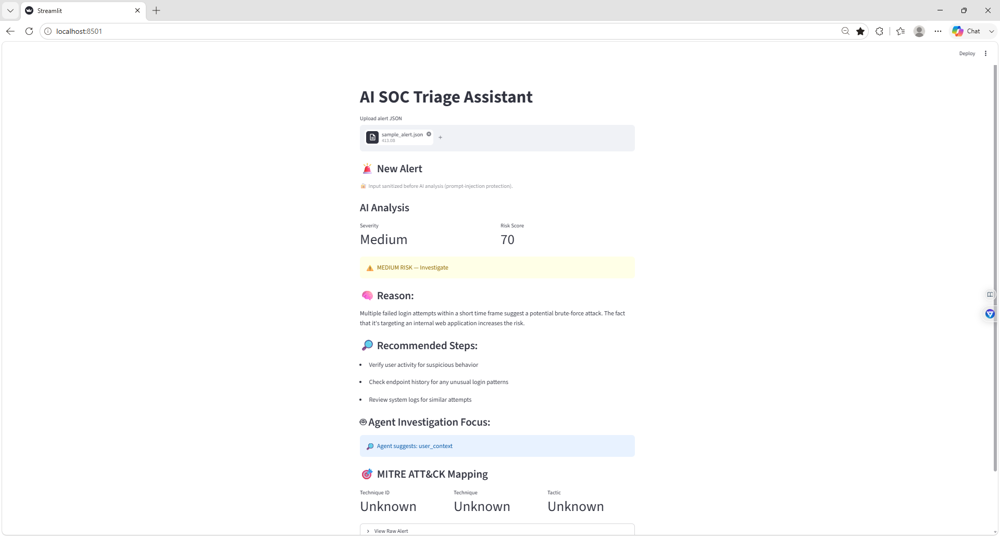
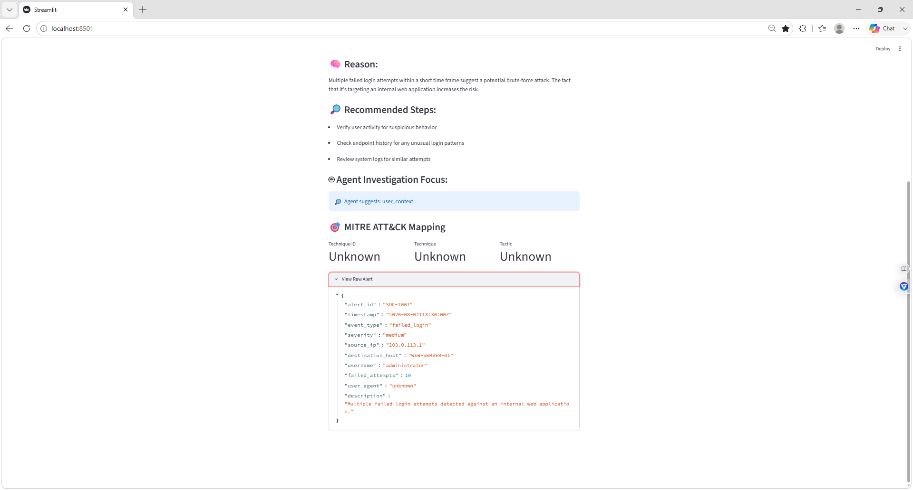

# Darwin-AI-SOC-Triage-Assistant-Lab

## Project Overview

Hands-on SOC Tier 1 lab deploying an AI-assisted alert triage dashboard with Ollama, Llama 3, Streamlit, JSON alert analysis, risk scoring, investigation recommendations and MITRE ATT&amp;CK mapping.

## 🌍 Why This Project Exists

SOC analysts may receive large volumes of alerts that require quick review and prioritization.

Common SOC challenges include:

- 🚨 Alert fatigue
- ⏱️ Slow manual investigations
- 🧠 Inconsistent triage decisions
- 📉 Limited explanations from traditional alerting tools
- 🔍 Difficulty identifying which alerts require escalation

Generative AI can assist with alert summaries, risk scoring, and investigation recommendations.

However, AI security tools may also produce:

- Incorrect conclusions
- Hallucinated recommendations
- Inconsistent output
- Unsafe containment advice
- Incorrect MITRE ATT&CK mappings

This lab demonstrates why AI output must be reviewed and validated by a human analyst.

---

## 🎯 Project Goal

Deploy and test an AI-assisted alert triage dashboard that can:

- Analyze structured security alerts
- Assign a severity level
- Generate a numerical risk score
- Explain why an alert may be suspicious
- Recommend SOC Tier 1 investigation steps
- Display the original alert evidence
- Suggest investigation areas
- Support human-controlled escalation decisions

Core design principle:

> AI assists with reasoning.  
> Code controls the workflow.  
> The analyst makes the final decision.

---

## 🧠 What This Lab Does

### 🤖 AI Alert Analysis

A local Llama 3 model analyzes a synthetic SOC alert and returns:

- Severity
- Risk score
- Reasoning
- Investigation recommendations
- Suggested investigation focus
- MITRE ATT&CK context

---

### 🔐 AI Security Guardrails

The application includes safeguards designed to reduce unsafe AI behavior:

- Input sanitization
- Prompt-injection protection
- Structured JSON processing
- Output validation
- Separation of AI reasoning from security actions
- Human review before escalation or containment

AI output is treated as untrusted until it is verified against the raw evidence.

---

### ⚙️ Human-in-the-Loop Decision Making

The AI can recommend actions, but it does not automatically:

- Block IP addresses
- Disable accounts
- Isolate endpoints
- Escalate incidents
- Modify firewall rules

A SOC analyst must validate the evidence and follow the organization’s incident-response playbook.

---

## 🧪 Alert Scenario

The lab used a synthetic alert involving repeated failed-login attempts against an internal web application.

### Alert Details

| Field | Value |
|---|---|
| Alert ID | SOC-1001 |
| Timestamp | 2026-08-02T18:30:00Z |
| Event Type | Failed Login |
| Initial Severity | Medium |
| Source IP | 203.0.113.1 |
| Destination Host | WEB-SERVER-01 |
| Username | administrator |
| Failed Attempts | 10 |
| User Agent | unknown |

The alert was created only for training and portfolio purposes.

---

## 📄 JSON Alert

The dashboard expected alerts inside a JSON list.

```json
[
  {
    "alert_id": "SOC-1001",
    "timestamp": "2026-08-02T18:30:00Z",
    "event_type": "failed_login",
    "severity": "medium",
    "source_ip": "203.0.113.1",
    "destination_host": "WEB-SERVER-01",
    "username": "administrator",
    "failed_attempts": 10,
    "user_agent": "unknown",
    "description": "Multiple failed login attempts detected against an internal web application."
  }
]
```

The alert initially failed when it was uploaded as a single JSON object. Placing the alert inside square brackets allowed the dashboard to process it correctly as a list.

---

## 📊 Investigation Results

The AI SOC Triage Assistant returned:

- **Severity:** Medium
- **Risk Score:** 70
- **Disposition:** Investigate
- **Possible Behavior:** Brute-force login activity
- **Investigation Focus:** User context

The AI reasoned that multiple failed-login attempts within a short time frame could indicate a brute-force attempt, especially because the activity targeted an internal web application.

---

## 🔎 Recommended Investigation Steps

The assistant recommended:

- Verify the user’s activity for suspicious behavior
- Check endpoint history for unusual login patterns
- Review system logs for similar login attempts

Additional SOC Tier 1 validation should include:

1. Confirm whether the source IP is internal, external, approved, or VPN-related.
2. Review authentication events around the alert timestamp.
3. Check whether any login eventually succeeded.
4. Determine whether other accounts were targeted.
5. Review the administrator account for unusual activity.
6. Search for related failed-login alerts.
7. Enrich the source IP using approved threat-intelligence services.
8. Compare the evidence with the incident-response playbook.
9. Escalate only when the evidence meets the required threshold.

---

## 🎯 MITRE ATT&CK Mapping

The dashboard displayed:

- Technique ID: Unknown
- Technique: Unknown
- Tactic: Unknown

Based on analyst review, the behavior may relate to:

- **T1110 – Brute Force**
- **Tactic: Credential Access**

The unknown result demonstrates that AI-generated MITRE ATT&CK mappings must be manually validated.

---

## 📸 Dashboard Preview

### 1. AI SOC Triage Risk Analysis

![AI SOC Triage Risk Analysis] (screenshots/01-AI-SOC-Triage-Risk-Analysis.png)



It also displayed:

- AI reasoning
- Recommended investigation steps
- Investigation focus
- MITRE ATT&CK section
- Medium-risk disposition

---

### 2. AI SOC Triage Raw Alert Review



- Alert ID `SOC-1001`
- Source IP `203.0.113.1`
- Destination host `WEB-SERVER-01`
- Administrator username
- Ten failed login attempts
- Original event description

This evidence was used to validate the AI-generated analysis.

---

## 🏗️ Architecture Overview

```text
JSON Alert
    ↓
Input Sanitization
    ↓
Local Llama 3 Analysis
    ↓
Structured Output Validation
    ↓
Risk Score and Severity
    ↓
Investigation Recommendations
    ↓
Streamlit Dashboard
    ↓
Human Analyst Review
```

---

## 🖥️ Technology Stack

- Python
- Streamlit
- Ollama
- Llama 3
- JSON
- Windows 11
- Command Prompt
- Visual Studio Code
- MITRE ATT&CK concepts

---

## ⚡ Quick Start

### Install dependencies

```powershell
python -m pip install -r requirements.txt
```

### Start Llama 3

```powershell
ollama run llama3
```

### Launch the dashboard

```powershell
python -m streamlit run app\dashboard.py
```

Open:

```text
http://localhost:8501
```

Keep the Command Prompt window open while the dashboard is running.

---

## ▶️ How I Ran the Lab

1. Downloaded the open-source project.
2. Extracted the repository files.
3. Installed Ollama on Windows.
4. Downloaded and tested Llama 3.
5. Installed the Python dependencies.
6. Started the Streamlit dashboard.
7. Created a synthetic failed-login JSON alert.
8. Corrected the JSON structure after a parsing error.
9. Uploaded the alert to the dashboard.
10. Reviewed the AI risk score and recommendations.
11. Expanded the raw alert to validate the evidence.
12. Compared the AI output with SOC Tier 1 procedures.

---

## 🔐 Security Design Principles Demonstrated

- Treat AI output as untrusted input
- Preserve raw evidence for analyst review
- Separate AI reasoning from enforcement
- Avoid automatic containment
- Validate structured output
- Require human approval before escalation
- Confirm MITRE ATT&CK mappings manually
- Use synthetic data in a controlled environment

---

## 📚 What I Learned

- LLM output is probabilistic rather than deterministic.
- AI risk scores must be validated.
- JSON structure directly affects automation reliability.
- Prompt injection can occur through alert or log content.
- Raw evidence should remain visible to the analyst.
- AI can assist with triage but should not replace analyst judgment.
- Local AI models can support privacy-conscious security testing.
- MITRE ATT&CK mapping requires reliable detection logic.
- A Tier 1 analyst should investigate before recommending containment.

---

## ✅ Skills Demonstrated

- SOC Tier 1 alert triage
- Failed-login investigation
- AI-assisted security analysis
- JSON creation and troubleshooting
- Python dependency installation
- Streamlit deployment
- Ollama configuration
- Local LLM testing
- Risk-score interpretation
- MITRE ATT&CK analysis
- Prompt-injection awareness
- Human-in-the-loop security operations
- Raw evidence validation
- Incident documentation

---

## 📈 Future Improvements

- Add deterministic brute-force detection rules
- Automatically map failed-login alerts to T1110
- Add VirusTotal or AbuseIPDB enrichment
- Check for successful logins after repeated failures
- Add account lockout data
- Add geographic and ASN enrichment
- Add confidence scoring
- Add analyst notes and case disposition fields
- Export investigation reports
- Add true-positive and false-positive classifications
- Add manual escalation approval
- Add alert deduplication and prioritization
- Test phishing, malware, PowerShell, and endpoint alerts

---

## ⚠️ Disclaimer

This project uses synthetic security alerts and was completed in a controlled local environment.

It is intended only for:

- Cybersecurity education
- SOC analyst training
- AI security research
- Portfolio development

No unauthorized systems, accounts, or networks were accessed.

---

## 🙏 Project Credit

This lab was based on the open-source **AI SOC Triage Assistant** created by `pranavibunny`.

Original repository:

```text
https://github.com/pranavibunny/ai-soc-triage-assistant
```

The original application and source code remain credited to the original author.

This repository documents my own:

- Installation
- Configuration
- Troubleshooting
- JSON alert creation
- Dashboard testing
- Screenshots
- SOC Tier 1 investigation
- Analyst validation
